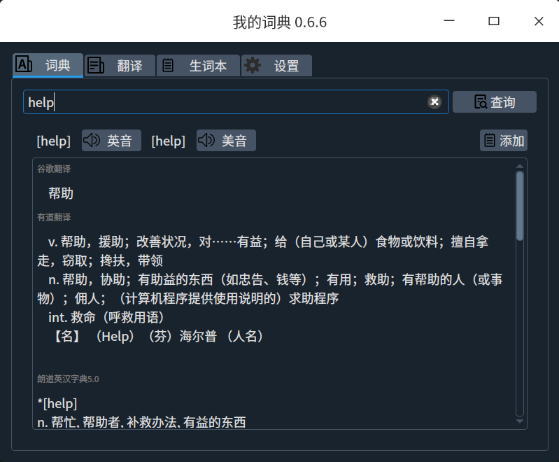
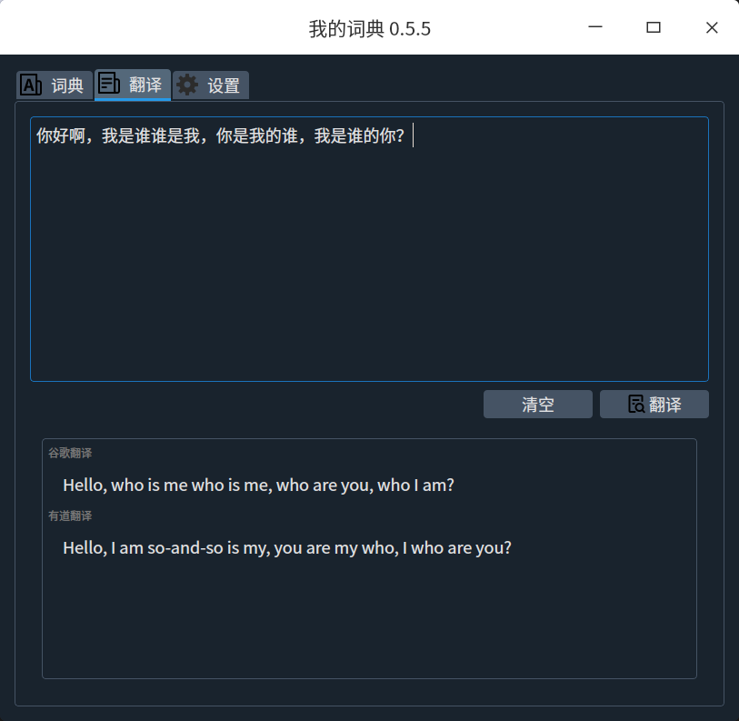
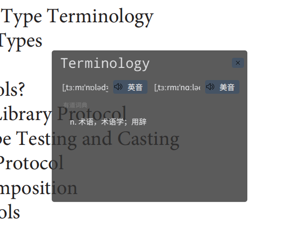
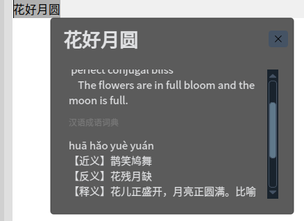
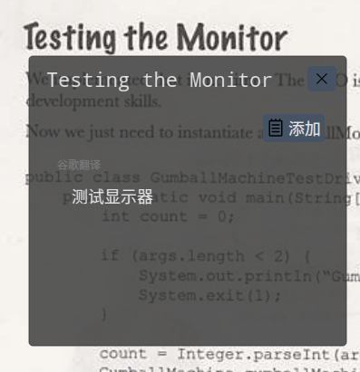
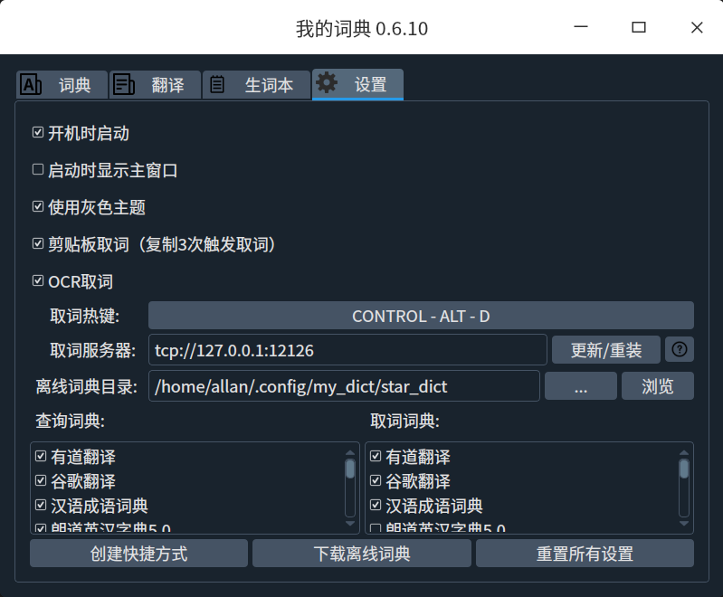
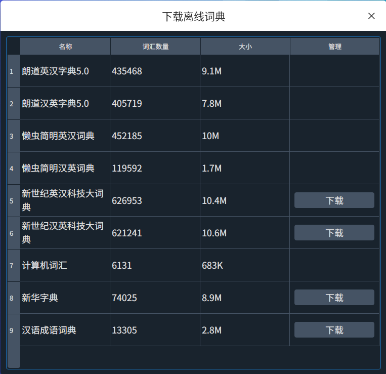
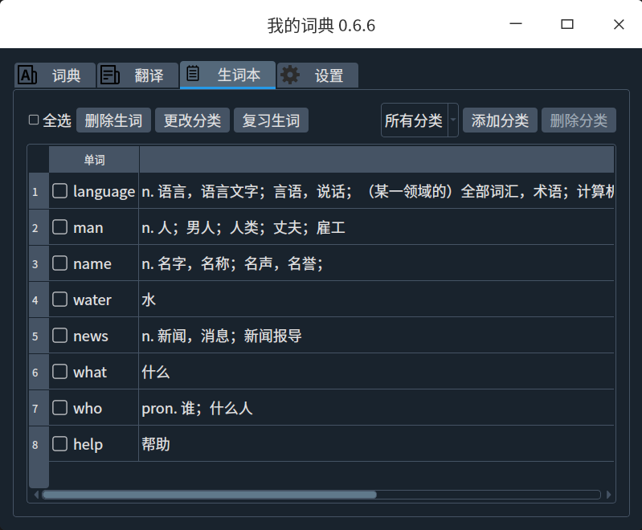
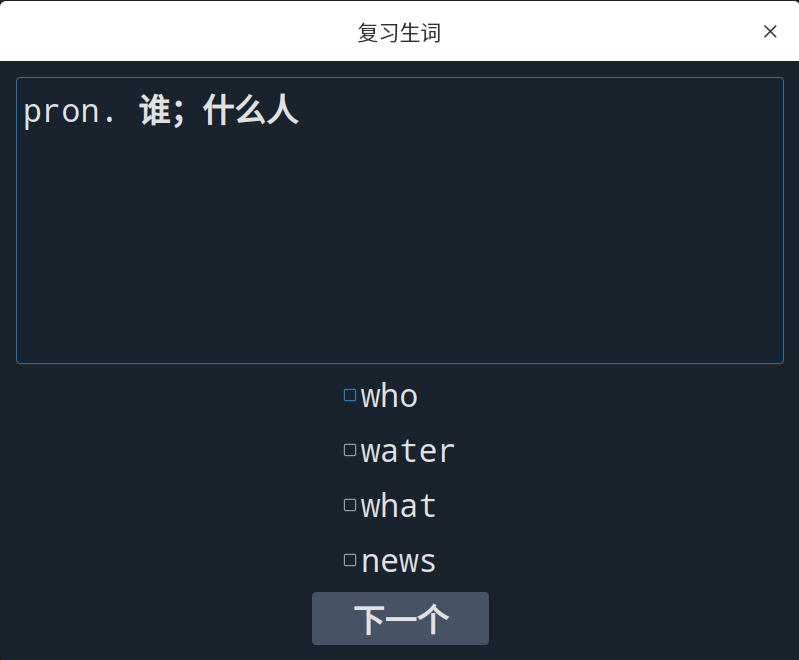

# 简介

一个词典客户端。支持：

- 剪贴板取词。
- OCR取词。
- 基本的查词功能。
- 基本的翻译功能。
- 支持开机自启动。
- 单文件，双击即可运行。
- 支持离线词典。

# 词典界面

# 剪贴板取词

# OCR取词

# 设置界面

# 下载离线词典

# 生词本

# 支持的系统

- UOS 社区版 20.2.4

理论上也支持其他Linux发行版，未测试。

# 感谢

- 感谢stardict项目，该程序的离线词典使用的该项目的词典。下载地址：http://download.huzheng.org
- 在线查词和翻译功能使用了有道词典的API，所有权归有道，不晓得是否可以使用，侵删。

# 开发

http://home.mydata.top:8093/?cat=10
